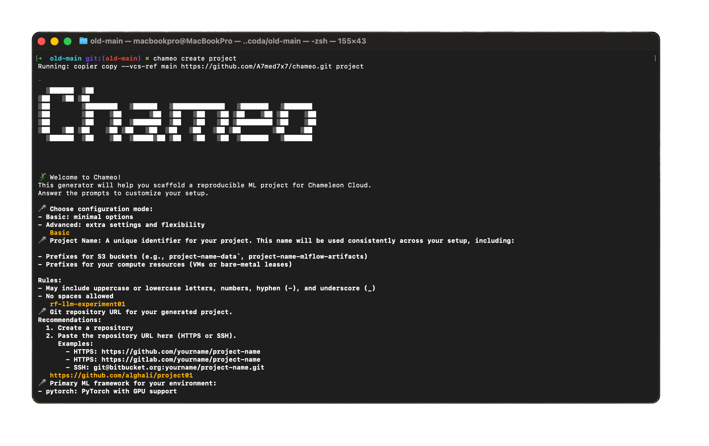

# **ReproGen**

[](https://github.com/copier-org/copier)

[](LICENSE)
[](https://github.com/a7med7x7/ReproGen/releases)
[](https://github.com/A7med7x7/ReproGen/tree/training-demo)


Chameo is a CLI tool for generating **reproducible machine-learning workflows from templates**, designed for researchers, students, and engineers working on **Chameleon Cloud**.

It scaffolds your project structure, Dockerized environment, MLflow tracking setup, and training templates, all based on your answers to a few guided prompts.



--- 

## **Why Chameo?**

Reproducibility in ML means re-running an experiment with the same code, data, and environment, and getting the same results.
In research, this is still a major problem: missing tracking, unclear dependencies, absent artifacts, and weak versioning make many experiments impossible to reproduce, even by their original authors. This slows scientific progress and reduces trust.

Meanwhile, production ML solves these issues through MLOps practices, but adopting the same tools in research is often painful. The setup, wiring MLflow, containers, environments, and storage, creates friction that keeps researchers from using reproducible workflows.

Chameo removes that friction.
It provides **ready-to-launch templates** with experiment tracking, consistent environments, and artifact persistence built in, so you can focus on running experiments instead of assembling infrastructure.

### **Supporting Reproducibility with Chameo**

* Brings MLOps-style reproducibility to research workflows
* Generates templates with tracking, versioning, and stable environments
* Lowers the barrier to reproducible experiments on Chameleon Cloud

> [!TIP]
 Use the **[experiment replay](./replay.md)** setup to reload and inspect past experiments stored on Chameleon Cloud, useful for revisiting, validating, or extending previous runs.

---

## **Installation**

Chameo requires Python 3.9+. we recommend installing it with pipx. Installation command options:
=== "With pipx (recommended)"

    ```bash
    pipx install chameo
    ```

=== "With pip"

    ```bash
    pip install chameo
    ```

=== "With conda (coming soon!)"

    ```bash
    ```
--- 

## **Quickstart**

to create a project:

```sh
chameo create myproject
```

The `chameo` commandline tool defaults to a copier template.

Answer a few questions, and the CLI will generate the project in that directory. See **[setup options](options.md)**  if you want to know the role of the questions and what they will generate. 


- [GitHub Repository](https://github.com/A7med7x7/ReproGen/)